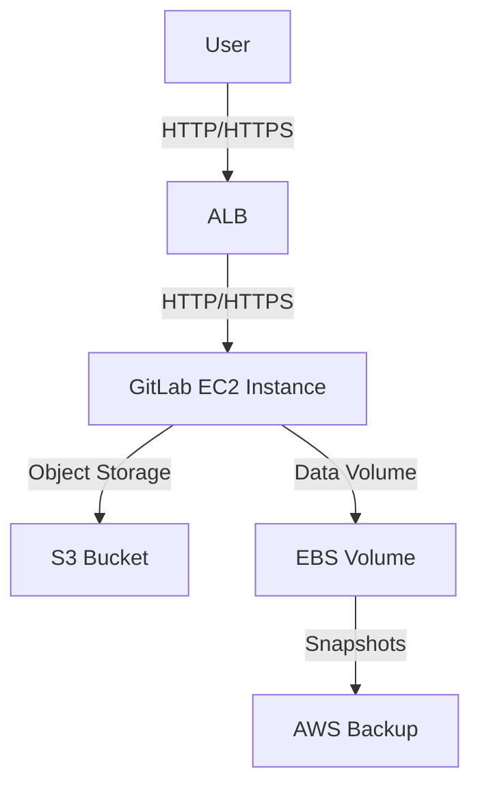

# GitLab Single-Instance Deployment on AWS

## Project Goal
This repository provides a cost-optimized infrastructure-as-code solution for deploying a single-instance GitLab on AWS. The design prioritizes cost efficiency using Graviton EC2 instances, S3 for object storage (optional), and EBS snapshots for backups (optional, Free Tier by default).

## Prerequisites
- AWS account with Free Tier eligibility
- AWS CLI configured with a profile
- SSH key pair (private key for Ansible/SSH, public key for Terraform)
- macOS or Linux with `terraform >= 1.6`, `ansible >= 9`, `aws` CLI, `make`, and `jq` installed
- Run `./bootstrap.sh` to validate your environment

## Deployment
1. **Bootstrap the environment:**
   ```bash
   ./bootstrap.sh
   ```
2. **Deploy infrastructure and configure GitLab:**
   ```bash
   make deploy
   ```
   - This provisions the VPC, subnet, security group, EC2 instance, and (optionally) ALB, S3, and backup resources.
   - Ansible configures GitLab CE, S3 object storage, and KMS encryption as needed.

## Verification
1. **Run smoke tests:**
   ```bash
   make verify
   ```
   - Checks HTTP 200 from GitLab URL
   - Verifies SSH clone
   - Runs a dry-run backup on the instance

## Cleanup
1. **Destroy all resources:**
   ```bash
   make destroy
   ```

## Architecture Diagram



**Notes:**
- Mermaid diagrams render best in Markdown viewers that support Mermaid (e.g., GitHub, VS Code with the Mermaid plugin).
- Changed `graph TD` to `flowchart TD` for better compatibility.
- Clarified edge labels and node names for readability.
- Ensure your Markdown preview tool supports Mermaid syntax.

## Cost Table
| Resource         | Free Tier Eligible | Notes                          |
|------------------|--------------------|--------------------------------|
| EC2 Instance     | No                 | t4g.medium                    |
| EBS Volume       | Yes                | 20 GiB gp3                    |
| S3 Buckets       | Partially          | 5 GiB free, additional costs  |
| ALB              | No                 | Optional, disabled by default |
| AWS Backup       | Partially          | Optional, disabled by default |

## Free-Tier Compliance
- All paid features (ALB, S3, backup) are **disabled by default**. Enable them in `infra/variables.tf` if needed.
- All resources are deployed in the `ap-south-1` region.

## Backup & Restore
- Backups are stored in S3 if enabled, or as EBS snapshots if AWS Backup is enabled.
- Restore instructions are provided in the documentation.

## Troubleshooting Log
- All errors and fixes encountered during deployment are documented in the Troubleshooting Log section of this repository.

## Known Issues
- Ensure the SSH key pair is located at `/Users/shreeraj/.ssh/basic-cloud-app-key-pair.pem` or update the path in Terraform outputs.
- S3 and ALB resources may incur costs if enabled.

## Notes
- This repository is Free Tier compliant by default. Review all variables before enabling paid features.
