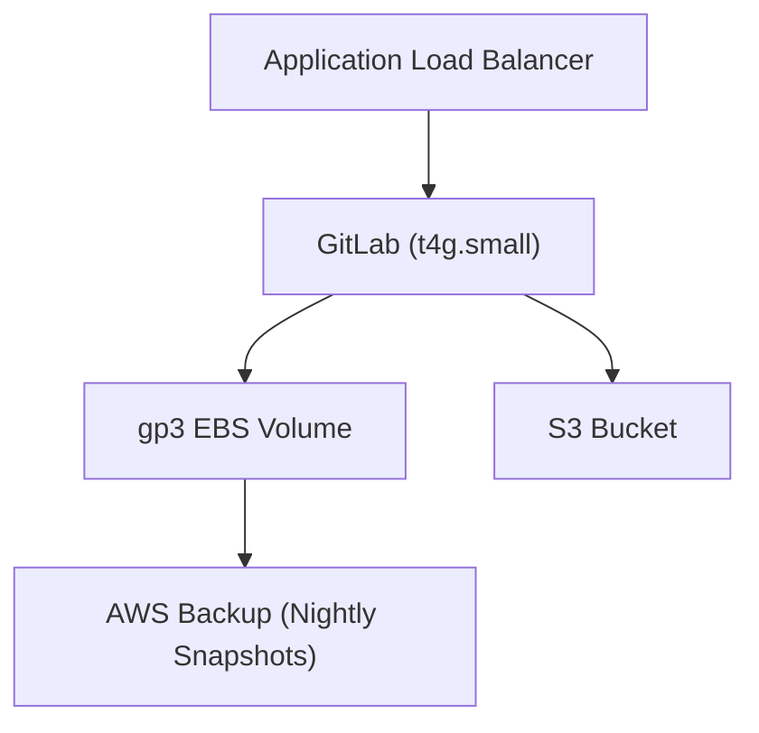

# GitLab Single-Instance Deployment on AWS

## Project Goal
This repository provides a cost-optimized infrastructure-as-code skeleton for deploying a single-instance GitLab on AWS. The design prioritizes cost efficiency using Graviton EC2 instances, S3 for object storage, and EBS snapshots for backups.

## High-Level Provisioning Steps
1. Initialize Terraform:
   ```bash
   terraform init
   ```
2. Plan the deployment:
   ```bash
   terraform plan
   ```
3. Apply the configuration:
   ```bash
   terraform apply
   ```

## Architecture Diagram


## Note
This repository only contains the skeleton structure for now. Terraform resources and modules will be added in the future.
