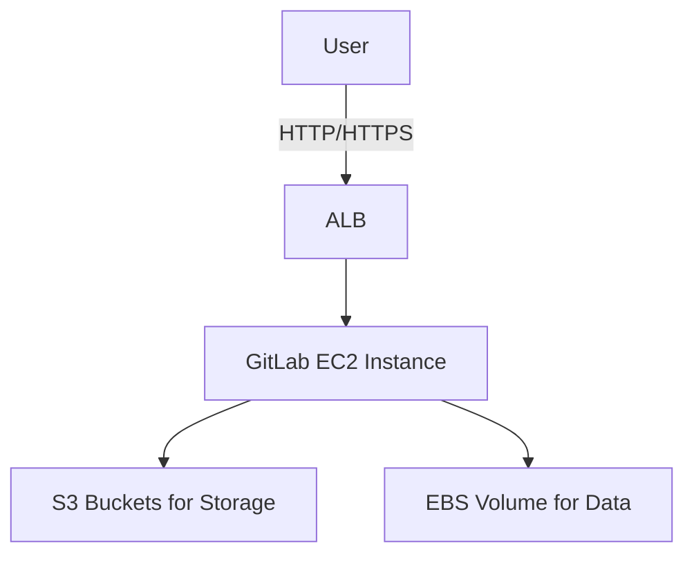

# GitLab Single-Instance Deployment on AWS

## Project Goal
This repository provides a cost-optimized infrastructure-as-code skeleton for deploying a single-instance GitLab on AWS. The design prioritizes cost efficiency using Graviton EC2 instances, S3 for object storage, and EBS snapshots for backups.

## Updated High-Level Provisioning Steps

### Deployment
1. Run the bootstrap script to validate the environment:
   ```bash
   ./bootstrap.sh
   ```
2. Deploy the infrastructure and configure GitLab:
   ```bash
   make deploy
   ```

### Verification
1. Verify the deployment:
   ```bash
   make verify
   ```

### Cleanup
1. Destroy the infrastructure:
   ```bash
   make destroy
   ```

## Architecture Diagram


## Cost Table
| Resource         | Free Tier Eligible | Notes                          |
|------------------|--------------------|--------------------------------|
| EC2 Instance     | Yes                | t4g.small                     |
| EBS Volume       | Yes                | 20 GiB gp3                    |
| S3 Buckets       | Partially          | 5 GiB free, additional costs  |

## Note
This repository only contains the skeleton structure for now. Terraform resources and modules will be added in the future.

## Notes
- All resources are deployed in the `ap-south-1` region.
- Ensure the SSH key pair is located at `/Users/shreeraj/.ssh/basic-cloud-app-key-pair.pem`.
