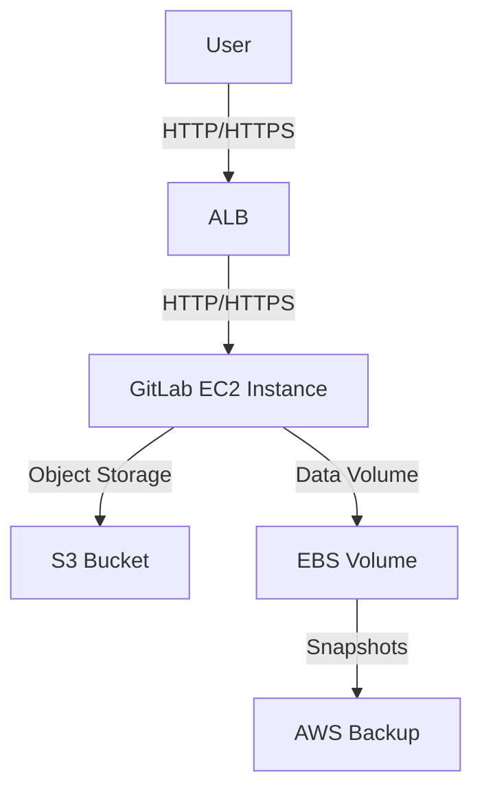

# GitLab Single-Instance Deployment on AWS

## Project Goal
This repository provides a cost-optimized infrastructure-as-code solution for deploying a single-instance GitLab on AWS. The design prioritizes cost efficiency using Graviton EC2 instances, S3 for object storage (optional), and EBS snapshots for backups (optional, Free Tier by default).

## Prerequisites
- AWS account with Free Tier eligibility
- AWS CLI configured with a profile
- SSH key pair (private key for Ansible/SSH, public key for Terraform)
- macOS or Linux with `terraform >= 1.6`, `ansible >= 9`, `aws` CLI, `make`, and `jq` installed
- Run `./bootstrap.sh` to validate your environment

## SSH Key Pair Setup

Before deploying, you must have an EC2 key pair in AWS and the corresponding private key file on your local machine.

### 1. Create a New EC2 Key Pair
- Go to the AWS Console → EC2 → Key Pairs.
- Click "Create key pair".
- Enter a name (e.g., `gitlab-keypair`).
- Choose file format: `.pem` (for Linux/macOS).
- Click "Create key pair" and download the `.pem` file. Save it securely (e.g., `~/Downloads/gitlab-keypair.pem`).
- Move the file to your `.ssh` directory and set permissions:
  ```bash
  mv ~/Downloads/gitlab-keypair.pem ~/.ssh/
  chmod 600 ~/.ssh/gitlab-keypair.pem
  ```

### 2. Use Your Key Pair for Deployment
- You must provide both the EC2 key pair name (as created in AWS) and the local path to your private key file when running `make deploy` and other commands.
- Example:
  ```bash
  export KEY_NAME=gitlab-keypair
  export SSH_PRIVATE_KEY=~/.ssh/gitlab-keypair.pem
  make deploy
  ```
- These variables are required for all Makefile commands that interact with the instance (deploy, install, verify).

- **The key pair must exist in AWS and the private key must be accessible on your machine before deployment.**

## Deployment
1. **Bootstrap the environment:**
   ```bash
   ./bootstrap.sh
   ```
2. **Deploy AWS infrastructure:**
   ```bash
   make deploy
   ```
   - Provisions the VPC, subnet, security group, EC2 instance, and (optionally) ALB, S3, and backup resources.
   - Waits for SSH to become available on the instance.
3. **Install and configure GitLab:**
   ```bash
   make install
   ```
   - Runs the Ansible playbook to install and configure GitLab CE on the provisioned EC2 instance.
4. **Access your GitLab instance:**
   - Open your browser and go to: `http://<public_ip>` (see below for how to get the public IP)
   - The login page is also directly accessible at: `http://<public_ip>/users/sign_in`
   - To get the public IP:
     ```bash
     terraform -chdir=infra output -raw gitlab_instance_public_ip
     ```
   - Example: `http://13.233.127.55`

5. **Initial Admin Credentials:**
   - **Username:** `root`
   - **Password:** The initial password is stored on the instance at `/etc/gitlab/initial_root_password`.
   - To retrieve it:
     ```bash
     ssh -i $SSH_PRIVATE_KEY ec2-user@<public_ip>
     sudo cat /etc/gitlab/initial_root_password
     ```
   - **Change this password after first login!**

6. **Create additional users:**
   - Log in as `root` and use the GitLab web UI to create new users for your organization.

## Verification
1. **Run smoke tests:**
   ```bash
   make verify
   ```
   - Checks HTTP 200 or 302 from GitLab URL (login page redirect is valid)
   - Verifies SSH clone
   - Runs a dry-run backup on the instance

## Cleanup
1. **Destroy all resources:**
   ```bash
   make destroy
   ```

## Architecture Diagram



## Cost Table
| Resource         | Free Tier Eligible | Notes                          |
|------------------|--------------------|--------------------------------|
| EC2 Instance     | No                 | t4g.medium                    |
| EBS Volume       | Yes                | 20 GiB gp3                    |
| S3 Buckets       | Partially          | 5 GiB free, additional costs  |
| ALB              | No                 | Optional, disabled by default |
| AWS Backup       | Partially          | Optional, disabled by default |

## Free-Tier Compliance
- All paid features (ALB, S3, backup) are **disabled by default**. Enable them in `infra/variables.tf` if needed.
- All resources are deployed in the `ap-south-1` region.

## Backup & Restore
- Backups are stored in S3 if enabled, or as EBS snapshots if AWS Backup is enabled.
- Restore instructions are provided in the documentation.

## Troubleshooting Log
- All errors and fixes encountered during deployment are documented in the Troubleshooting Log section of this repository.

## Known Issues
- Ensure the SSH key pair is located at the expected path or update the path in Terraform outputs.
- Ensure you provide the correct key pair name and private key path as described above. The Makefile and Terraform scripts no longer use a hardcoded path.
- S3 and ALB resources may incur costs if enabled.

## Notes
- This repository is Free Tier compliant by default. Review all variables before enabling paid features.
