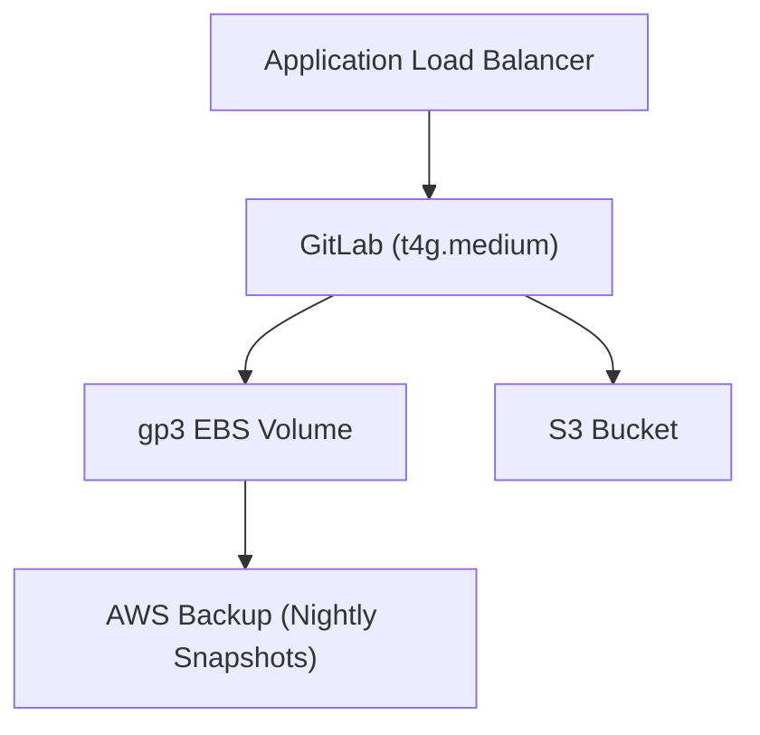

# Design Document

## Architecture Narrative
This project deploys a single-instance GitLab on AWS using Graviton EC2 instances for cost efficiency. S3 is used for object storage and LFS, while EBS volumes are backed up nightly using AWS Backup.

### Key Decisions
- **Single Instance**: Simplifies deployment and reduces costs.
- **Graviton EC2**: Leverages ARM-based t4g.medium for cost and performance.
- **S3 for Objects/LFS**: Cost-effective and scalable storage.
- **AWS Backup**: Automates nightly EBS snapshots.

## Architecture Diagram

## Security Measures
- Private subnets for EC2 instances.
- Security Group rules to restrict access.
- IAM roles with least privilege.
- KMS for encryption of EBS and S3.

## Cost Table
| Resource                           | Qty / Size         | On‑Demand ($/mo) | 3‑yr Compute Savings Plan ($/mo)* |
|------------------------------------|--------------------|------------------|----------------------------------|
| t4g.medium EC2                     | 1 instance         | 12.26            | 8.83                             |
| gp3 EBS                            | 20 GiB             | 1.60             | 1.60                             |
| S3 Standard                        | 50 GiB             | 1.15             | 1.15                             |
| AWS Backup (EBS snapshots)         | 20 GiB retained    | 1.00             | 1.00                             |
| **Total**                          |                    | **16.01**        | **12.58**                        |

## Toolchain Decisions
- **Terraform**: Chosen for its modularity and community support.
- **Pre-commit Hooks**: Ensures code quality.
- **Ruff**: Placeholder for Python linting.
