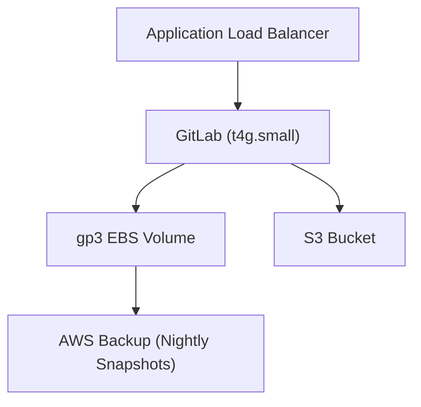

# Design Document

## Architecture Narrative
This project deploys a single-instance GitLab on AWS using Graviton EC2 instances for cost efficiency. S3 is used for object storage and LFS, while EBS volumes are backed up nightly using AWS Backup.

### Key Decisions
- **Single Instance**: Simplifies deployment and reduces costs.
- **Graviton EC2**: Leverages ARM-based t4g.small for cost and performance.
- **S3 for Objects/LFS**: Cost-effective and scalable storage.
- **AWS Backup**: Automates nightly EBS snapshots.

## Architecture Diagram

## Security Measures
- Private subnets for EC2 instances.
- Security Group rules to restrict access.
- IAM roles with least privilege.
- KMS for encryption of EBS and S3.

## Future Scale-Out Path
- Move PostgreSQL to RDS.
- Add ElastiCache for Redis.
- Use an Auto Scaling Group for GitLab Runners.

## Cost Table
| Resource         | On-Demand ($/mo) | 3-Year CSP ($/mo) |
|------------------|------------------|-------------------|
| t4g.small EC2    | 15               | 10                |
| gp3 EBS (100GB)  | 10               | 7                 |
| S3 (100GB)       | 2                | 2                 |
| AWS Backup       | 5                | 5                 |
| **Total**        | **32**           | **24**            |

## Toolchain Decisions
- **Terraform**: Chosen for its modularity and community support.
- **Pre-commit Hooks**: Ensures code quality.
- **Ruff**: Placeholder for Python linting.
